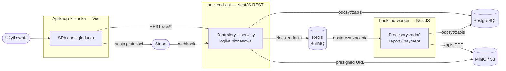
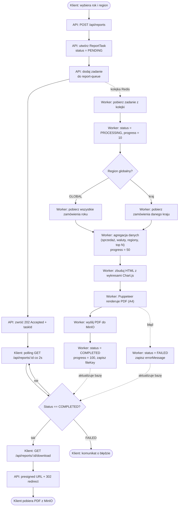
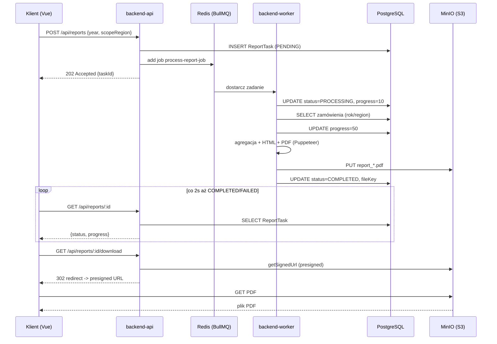
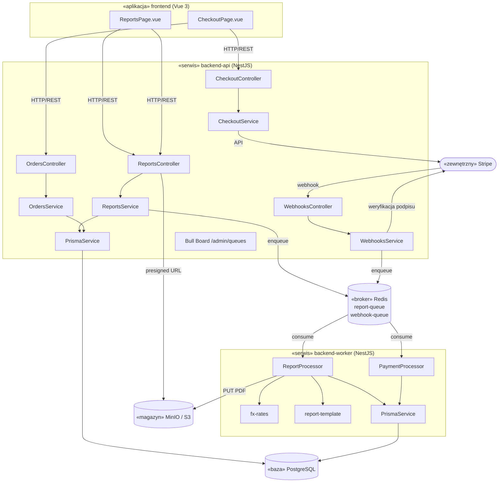
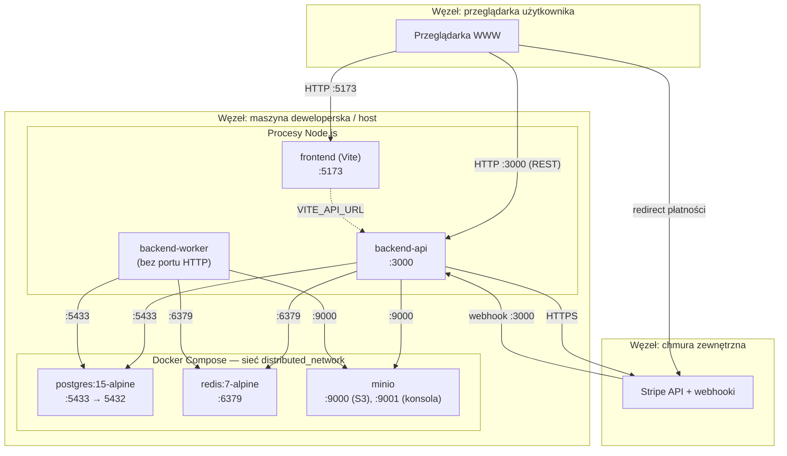
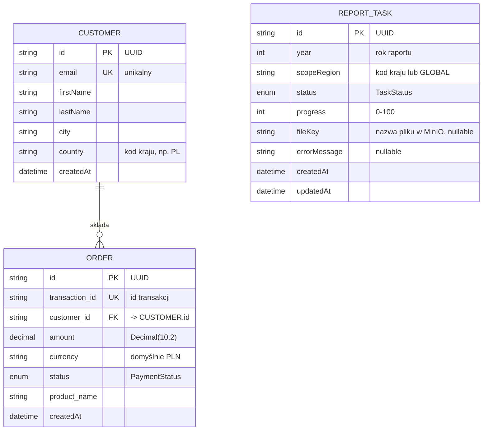
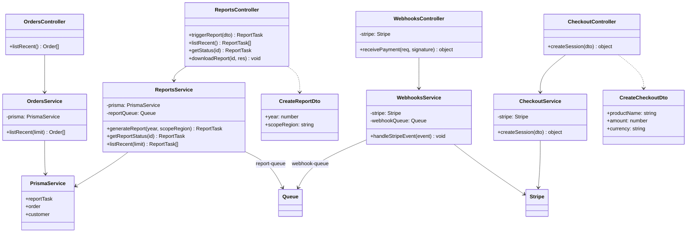
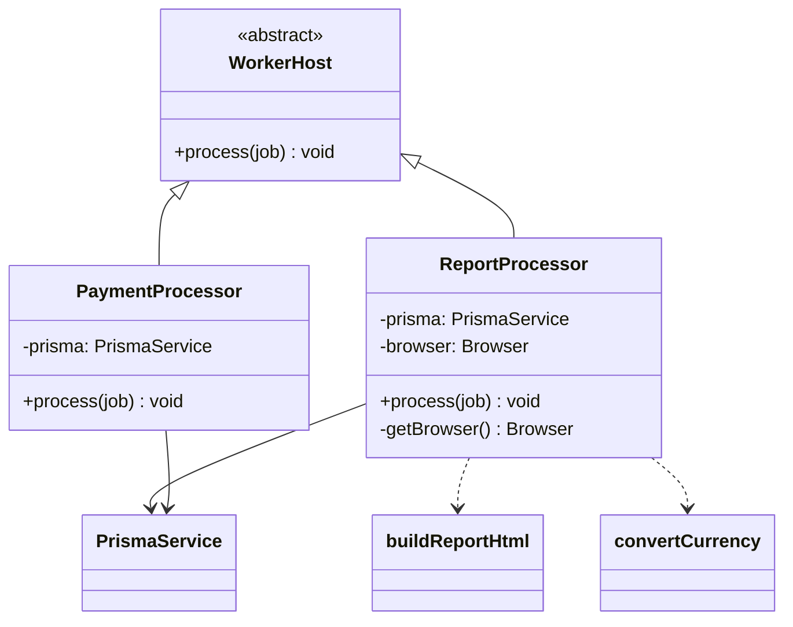

# Dokumentacja techniczna — SaaS Analytics Platform

**System rozproszony z asynchronicznym przetwarzaniem długotrwałego zadania po stronie serwera**

### Autorzy

| Imię i nazwisko | Nr albumu |
|---|---|
| Bartosz Jezioro | 72018 |
| Konrad Ehrenfeld | 72955 |
| Damian Zięba | 72966 |

---

## Spis treści

1. [Opis realizowanego zadania](#1-opis-realizowanego-zadania)
2. [Opis długotrwałego zadania po stronie serwera](#2-opis-długotrwałego-zadania-po-stronie-serwera)
3. [Stos technologiczny](#3-stos-technologiczny)
4. [Architektura systemu](#4-architektura-systemu)
5. [Diagramy UML](#5-diagramy-uml)
   - [5.1. Diagram aktywności (proces biznesowy)](#51-diagram-aktywności--proces-biznesowy)
   - [5.2. Diagram komponentów](#52-diagram-komponentów)
   - [5.3. Diagram wdrożenia](#53-diagram-wdrożenia)
6. [Diagram ERD i opis encji](#6-diagram-erd-i-opis-encji)
7. [Projekt API serwisu](#7-projekt-api-serwisu)
   - [7.1. Specyfikacja endpointów REST](#71-specyfikacja-endpointów-rest)
   - [7.2. Diagram klas](#72-diagram-klas)
8. [Aplikacja kliencka](#8-aplikacja-kliencka)
9. [Realizacja wymagań A / B / C](#9-realizacja-wymagań-a--b--c)
10. [Uruchomienie systemu](#10-uruchomienie-systemu)

---

## 1. Opis realizowanego zadania

**SaaS Analytics Platform** to rozproszona platforma analityczna dla sklepu/usługi typu SaaS. System przyjmuje płatności od klientów, utrwala je jako zamówienia w bazie danych, a na żądanie generuje rozbudowane raporty finansowe w formacie PDF (wykresy sprzedaży, podział na regiony, waluty, produkty i klientów).

Aplikacja została zbudowana w architekturze rozproszonej, w której obowiązki są rozdzielone pomiędzy niezależnie uruchamiane serwisy komunikujące się przez interfejs REST, kolejkę komunikatów oraz współdzieloną bazę danych:

- **Serwis API (`backend-api`)** — warstwa logiki biznesowej. Udostępnia interfejs REST dla aplikacji klienckiej, waliduje żądania, tworzy rekordy w bazie i zleca długotrwałe zadania do kolejki.
- **Serwis przetwarzający (`backend-worker`)** — odrębny proces bez interfejsu HTTP, który nasłuchuje na kolejce i wykonuje czasochłonne zadania (generowanie PDF, zapis płatności) poza kontekstem żądania klienta.
- **Aplikacja kliencka (`frontend`)** — jednostronicowa aplikacja (SPA) we Vue, przez którą użytkownik uruchamia zadania i odbiera ich wyniki.
- **Infrastruktura** — PostgreSQL (baza danych), Redis (broker kolejki BullMQ) oraz MinIO (magazyn obiektowy zgodny z S3 na pliki PDF), uruchamiane w kontenerach Docker.

**Problem, który rozwiązuje architektura rozproszona:** wygenerowanie raportu wymaga agregacji tysięcy zamówień, przeliczenia walut, wyrenderowania kilku wykresów w przeglądarce i złożenia wielostronicowego PDF. Wykonanie tego synchronicznie w ramach żądania HTTP zablokowałoby połączenie na wiele sekund i groziło timeoutem. Dlatego zadanie jest zlecane do kolejki i przetwarzane asynchronicznie przez osobny serwis, a klient odbiera wynik dopiero gdy jest gotowy.

W systemie występują **dwa asynchroniczne przepływy** realizowane przez serwis przetwarzający:

1. **Generowanie raportu PDF** — główne długotrwałe zadanie inicjowane bezpośrednio przez klienta.
2. **Przetwarzanie płatności** — zadanie inicjowane zdarzeniem (webhook) z zewnętrznej bramki płatniczej Stripe.

---

## 2. Opis długotrwałego zadania po stronie serwera

### 2.1. Główne zadanie — generowanie raportu PDF

Długotrwałe zadanie to **wygenerowanie finansowego raportu PDF** dla wybranego roku i regionu. Zadanie jest w całości wykonywane po stronie serwera przez serwis `backend-worker`, poza żądaniem klienta.

**Przebieg zadania (procesor `ReportProcessor`):**

1. **Przyjęcie żądania.** Klient wywołuje `POST /api/reports` z rokiem i regionem. Serwis API tworzy w bazie rekord `ReportTask` ze statusem `PENDING`, dodaje zadanie `process-report-job` do kolejki `report-queue` (Redis) i natychmiast zwraca `202 Accepted` z identyfikatorem zadania. **Żądanie klienta kończy się w tym momencie** — dalsze przetwarzanie odbywa się w tle.
2. **Podjęcie zadania.** Worker pobiera zadanie z kolejki, ustawia status `PROCESSING` i `progress = 10`.
3. **Pobranie danych.** Worker odczytuje z bazy wszystkie zamówienia z danego roku — globalnie (`scopeRegion = GLOBAL`) lub tylko dla wybranego kraju. Ustawia `progress = 50`.
4. **Agregacja danych.** Na podstawie zamówień liczone są: sprzedaż miesięczna, podział statusów (opłacone / zwrócone / nieudane), przychód wg walut, przychód wg regionów, top 10 produktów oraz top 10 klientów. Kwoty w różnych walutach są przeliczane do jednej waluty bazowej raportu (moduł `fx-rates`), aby sumy były porównywalne.
5. **Renderowanie HTML.** Zagregowane dane są wstrzykiwane do szablonu HTML z wykresami Chart.js (moduł `report-template`).
6. **Generowanie PDF.** Worker uruchamia headless Chromium (Puppeteer), ładuje HTML, czeka aż wykresy się wyrenderują (`window.chartsReady === true`) i eksportuje stronę do pliku PDF w formacie A4.
7. **Zapis wyniku.** Gotowy PDF jest przesyłany do magazynu obiektowego MinIO (S3). W bazie aktualizowany jest status `COMPLETED`, `progress = 100` oraz `fileKey` (nazwa pliku w magazynie).
8. **Obsługa błędu.** W razie wyjątku status ustawiany jest na `FAILED`, zapisywana jest treść błędu (`errorMessage`), a wyjątek jest ponownie rzucany, co pozwala mechanizmowi BullMQ na ewentualne ponowienie.

**Odbiór wyniku przez klienta:** aplikacja kliencka odpytuje `GET /api/reports/:id` co 2 sekundy (polling), śledząc status i pasek postępu. Po osiągnięciu statusu `COMPLETED` klient pobiera plik przez `GET /api/reports/:id/download`, który przekierowuje (`302`) na **presigned URL** do MinIO ważny przez 5 minut.

**Dlaczego to zadanie jest długotrwałe:** łączy agregację nad tysiącami rekordów bazy, uruchomienie pełnej przeglądarki, renderowanie kilku wykresów oraz złożenie wielostronicowego dokumentu PDF — operacje rzędu sekund do kilkudziesięciu sekund, nieakceptowalne w trybie synchronicznym.

### 2.2. Zadanie poboczne — przetwarzanie płatności

Drugi asynchroniczny przepływ obsługuje płatności (procesor `PaymentProcessor` na kolejce `webhook-queue`):

1. Klient inicjuje płatność przez `POST /api/checkout`; serwis API tworzy sesję Stripe Checkout i zwraca URL, na który przeglądarka jest przekierowywana.
2. Po zakończeniu płatności Stripe wysyła zdarzenie (webhook) na `POST /api/webhooks`. Serwis API weryfikuje podpis kryptograficzny zdarzenia i dodaje zadanie `process-payment` do kolejki.
3. Worker pobiera zadanie, tworzy/aktualizuje rekord `Customer` (upsert po adresie e-mail) i zapisuje `Order`. Operacja jest **idempotentna** — powtórne zdarzenie o tym samym `transactionId` jest ignorowane (unikalność w bazie + obsługa błędu `P2002`).

---

## 3. Stos technologiczny

| Warstwa | Technologia | Zastosowanie |
|---|---|---|
| Język | **TypeScript** | Cały backend i frontend |
| Framework backendu | **NestJS 11** | Serwis API oraz serwis worker (moduły, DI, kontrolery) |
| ORM / dostęp do bazy | **Prisma 7** (`@prisma/adapter-pg`) | Modelowanie i dostęp do PostgreSQL |
| Baza danych | **PostgreSQL 15** | Trwałe przechowywanie klientów, zamówień, zadań |
| Kolejka / broker | **BullMQ 5** na **Redis 7** | Integracja API ↔ worker, kolejki `report-queue` i `webhook-queue` |
| Generowanie PDF | **Puppeteer 25** (headless Chromium) | Renderowanie raportu HTML → PDF |
| Wykresy | **Chart.js 4** | Wykresy w raporcie (liniowe, kołowe, słupkowe) |
| Magazyn plików | **MinIO** (zgodny z S3) + **AWS SDK v3** | Przechowywanie plików PDF, presigned URL |
| Płatności | **Stripe SDK** (tryb testowy) | Sesje Checkout i webhooki płatności |
| Walidacja | **class-validator**, **class-transformer** | Walidacja DTO w API |
| Monitoring kolejek | **Bull Board** | Podgląd kolejek pod `/admin/queues` |
| Frontend | **Vue 3.5** + **PrimeVue 4** (motyw Aura) | Aplikacja kliencka (SPA) |
| Build / dev frontendu | **Vite 8** | Serwer deweloperski i bundling |
| HTTP klienta | **Axios** | Komunikacja frontend → API |
| Konteneryzacja | **Docker Compose** | Uruchomienie PostgreSQL, Redis, MinIO |
| Testy | **Jest** (backend), **Vitest** + **Playwright** (frontend) | Testy jednostkowe i e2e |

---

## 4. Architektura systemu

System składa się z trzech niezależnie uruchamianych aplikacji (frontend, API, worker) oraz trzech usług infrastrukturalnych (baza, kolejka, magazyn). Komunikacja odbywa się czterema kanałami:

- **HTTP/REST** — frontend ↔ API oraz Stripe → API (webhook),
- **Kolejka Redis (BullMQ)** — API → worker (zlecanie zadań),
- **Baza PostgreSQL** — współdzielona przez API i worker (stan zadań, dane biznesowe),
- **Magazyn S3 (MinIO)** — worker zapisuje pliki, API generuje do nich presigned URL.



Kluczową cechą architektury jest **rozdzielenie serwisu przyjmującego żądania (API) od serwisu wykonującego pracę (worker)**. Dzięki temu API pozostaje responsywne (zwraca odpowiedź w milisekundach), a ciężkie zadania są kolejkowane i przetwarzane niezależnie — można je skalować, ponawiać i monitorować bez wpływu na warstwę żądań klienta.

---

## 5. Diagramy UML

### 5.1. Diagram aktywności — proces biznesowy

Poniższy diagram przedstawia pełny proces biznesowy generowania raportu PDF — od żądania klienta, przez asynchroniczne przetwarzanie w workerze, po odebranie gotowego pliku. Zaznaczono, który komponent wykonuje daną czynność.



**Opis:** proces rozpoczyna się po stronie klienta i natychmiast rozgałęzia się na dwie równoległe ścieżki. Ścieżka API kończy się szybką odpowiedzią `202` — klient nie czeka na wynik. Ścieżka workera przetwarza zadanie w tle, zapisując postęp i wynik w bazie. Klient, odpytując bazę pośrednio przez API (polling), wykrywa zmianę statusu i pobiera plik. Punkt decyzyjny „Region globalny?" pokazuje wariantowość zapytania, a gałąź błędu — obsługę wyjątków z oznaczeniem zadania jako `FAILED`.

Sekwencyjny widok tej samej interakcji (podkreślający asynchroniczność „fire-and-poll"):



### 5.2. Diagram komponentów

Diagram przedstawia komponenty systemu, ich wewnętrzne pod-moduły oraz interfejsy (kanały komunikacji) między nimi.



**Opis komponentów:**

- **frontend** — dwa główne widoki: `ReportsPage` (generowanie i pobieranie raportów, polling) oraz `CheckoutPage` (płatności i lista transakcji). Komunikuje się wyłącznie przez REST z serwisem API.
- **backend-api** — cztery kontrolery (Reports, Checkout, Webhooks, Orders) oddzielone od serwisów z logiką. `ReportsService` i `WebhooksService` publikują zadania do Redisa; `PrismaService` zapewnia dostęp do bazy; Bull Board udostępnia panel monitoringu kolejek.
- **backend-worker** — dwa procesory konsumujące kolejki (`ReportProcessor`, `PaymentProcessor`) wspierane modułami pomocniczymi `fx-rates` (kursy walut) i `report-template` (szablon HTML raportu).
- **Redis / PostgreSQL / MinIO** — usługi infrastrukturalne stanowiące punkty integracji między serwisami.
- **Stripe** — zewnętrzna bramka płatnicza integrowana przez REST (Checkout) i webhooki.

### 5.3. Diagram wdrożenia

Diagram pokazuje rozmieszczenie artefaktów wykonywalnych na węzłach oraz otwarte porty. Usługi infrastrukturalne działają w kontenerach Docker w jednej sieci mostkowej (`distributed_network`).



**Opis:** aplikacje Node.js (`frontend`, `backend-api`, `backend-worker`) uruchamiane są jako osobne procesy na hoście, natomiast baza, kolejka i magazyn działają jako kontenery Docker. `backend-worker` nie wystawia portu HTTP — komunikuje się wyłącznie przez Redis, PostgreSQL i MinIO. Port PostgreSQL jest zmapowany na hoście jako `5433` (aby nie kolidować z lokalną instalacją bazy), a MinIO udostępnia zarówno API S3 (`:9000`), jak i konsolę WWW (`:9001`). Stripe jest usługą zewnętrzną w chmurze, komunikującą się dwukierunkowo z serwisem API.

---

## 6. Diagram ERD i opis encji



**Opis encji:**

- **CUSTOMER** — klient dokonujący płatności. Identyfikowany unikalnym adresem e-mail (rekordy są scalane operacją `upsert` po e-mailu, więc jeden klient może mieć wiele zamówień). Przechowuje dane adresowe (`city`, `country`) potrzebne do raportów regionalnych. Relacja 1:N z `ORDER` z kaskadowym usuwaniem (`onDelete: Cascade`).
- **ORDER** — pojedyncza transakcja/zamówienie. `transaction_id` jest unikalne — zapewnia **idempotencję** przetwarzania płatności (powtórny webhook nie utworzy duplikatu). `amount` przechowywane jako `Decimal(10,2)` dla dokładności finansowej; `currency` pozwala mieszać waluty (przeliczane później w raporcie). Pole `status` typu `PaymentStatus`.
- **REPORT_TASK** — reprezentuje długotrwałe zadanie generowania raportu. Jest **centralnym punktem integracji przez bazę**: API tworzy rekord, worker aktualizuje jego `status`, `progress` i `fileKey`, a klient odczytuje go przez polling. Encja jest niezależna (brak relacji) — opisuje stan zadania, nie dane biznesowe. `fileKey` wypełniany jest dopiero po zapisaniu PDF w MinIO.

**Typy wyliczeniowe:**

- `PaymentStatus` = `PAID` | `REFUNDED` | `FAILED` — status płatności/zamówienia.
- `TaskStatus` = `PENDING` | `PROCESSING` | `COMPLETED` | `FAILED` — cykl życia zadania raportu.

> Uwaga projektowa: model `ReportTask` jest zduplikowany w schematach Prisma serwisu API i workera, ponieważ oba serwisy mają własny wygenerowany klient Prisma, ale operują na **tej samej fizycznej bazie** (współdzielonej instancji PostgreSQL). To właśnie umożliwia integrację przez bazę danych.

---

## 7. Projekt API serwisu

### 7.1. Specyfikacja endpointów REST

Wszystkie endpointy mają prefiks `/api`. Walidacja ciał żądań odbywa się globalnym `ValidationPipe` (odrzucanie nadmiarowych pól, transformacja do DTO).

| Metoda | Ścieżka | Ciało żądania | Odpowiedź | Kod | Opis |
|---|---|---|---|---|---|
| `POST` | `/api/reports` | `{ year, scopeRegion }` | `ReportTask` | `202` | Zleca wygenerowanie raportu (asynchronicznie). Zwraca zadanie ze statusem `PENDING`. |
| `GET` | `/api/reports` | — | `ReportTask[]` | `200` | Lista 20 ostatnich zadań (historia). |
| `GET` | `/api/reports/:id` | — | `ReportTask` | `200` | Status pojedynczego zadania (używane do pollingu). |
| `GET` | `/api/reports/:id/download` | — | — | `302` | Przekierowanie na presigned URL do PDF (jeśli `COMPLETED`), inaczej `404`. |
| `POST` | `/api/checkout` | `{ productName, amount, currency }` | `{ url }` | `201` | Tworzy sesję Stripe Checkout, zwraca URL do przekierowania. |
| `POST` | `/api/webhooks` | surowy payload Stripe | `{ received: true }` | `202` | Odbiera zdarzenia Stripe (po weryfikacji podpisu), zleca zapis płatności. |
| `GET` | `/api/orders` | — | `Order[]` | `200` | Lista 20 ostatnich zamówień. |
| `GET` | `/admin/queues` | — | UI | `200` | Panel Bull Board do monitoringu kolejek. |

**DTO (obiekty transferu i walidacja):**

- `CreateReportDto` — `year: int (2000–2100)`, `scopeRegion: string (niepusty)`.
- `CreateCheckoutDto` — `productName: string`, `amount: number (dodatni)`, `currency: string`.

**Zadania w kolejkach:**

| Kolejka | Nazwa zadania | Dane (payload) | Procesor |
|---|---|---|---|
| `report-queue` | `process-report-job` | `{ taskId, year, scopeRegion }` | `ReportProcessor` |
| `webhook-queue` | `process-payment` | `{ transactionId, amount, currency, customerEmail, status, ... }` | `PaymentProcessor` |

### 7.2. Diagram klas

Diagram klas serwisu API (kontrolery, serwisy, DTO i zależności). Wzorzec: cienkie kontrolery delegujące do serwisów, wstrzykiwanie zależności (DI) przez konstruktor.



Dla kompletności — procesory serwisu workera dziedziczą po `WorkerHost` z BullMQ i implementują metodę `process(job)`:



---

## 8. Aplikacja kliencka

Aplikacja kliencka to jednostronicowa aplikacja we **Vue 3** (Composition API) z biblioteką komponentów **PrimeVue**. Interfejs dzieli się na dwie zakładki dostępne z bocznego menu:

**Zakładka „Raporty" (`ReportsPage.vue`):**

- Formularz wyboru roku i regionu oraz przycisk „Generuj raport PDF".
- Po wysłaniu `POST /api/reports` aplikacja uruchamia **polling** (`GET /api/reports/:id` co 2 s), aktualizując status i pasek postępu (`ProgressBar`).
- Po statusie `COMPLETED` pojawia się przycisk pobrania (`GET /api/reports/:id/download`), który pobiera plik jako blob.
- Tabela historii pokazuje 20 ostatnich zadań wraz ze statusami (`Tag` z kolorem zależnym od statusu).

**Zakładka „Checkout" (`CheckoutPage.vue`):**

- Formularz nowej płatności (nazwa produktu, kwota, waluta) z podglądem podsumowania.
- Po wysłaniu `POST /api/checkout` przeglądarka jest przekierowywana na stronę płatności Stripe.
- Tabela „Ostatnie transakcje" prezentuje zamówienia z `GET /api/orders`.

Adres API pochodzi ze zmiennej środowiskowej `VITE_API_URL`. Komunikacja odbywa się przez **Axios**. Aplikacja jest w pełni zdekonstruowana od backendu — korzysta wyłącznie z publicznego interfejsu REST.

---

## 9. Realizacja wymagań A / B / C

System realizuje **wszystkie trzy poziomy** wymagań, co odpowiada ocenie **5.0**.

| Punkt | Wymaganie | Realizacja w systemie |
|---|---|---|
| **A** | Serwis API wykonujący długotrwałe zadanie **w ramach** żądania klienta | Wariant bazowy (synchroniczny) — w systemie świadomie zastąpiony podejściem asynchronicznym (B/C), które go obejmuje. Endpoint `POST /api/reports` mógłby wykonać pracę w żądaniu, ale zamiast tego ją deleguje. |
| **B** | Serwis API wykonujący długotrwałe zadanie **poza** żądaniem klienta, udostępniający wynik na żądanie | ✅ `POST /api/reports` zwraca natychmiast `202` + `taskId`. Raport powstaje w tle; klient odbiera wynik przez polling (`GET /api/reports/:id`) i pobiera plik (`GET /api/reports/:id/download`) po jego ukończeniu. |
| **C** | Serwis API **oraz dodatkowy serwis** wykonujący długotrwałe zadanie, integracja przez **bazę danych lub system kolejkowy** | ✅ Osobny serwis `backend-worker` wykonuje zadanie. Integracja realizowana **dwoma** mechanizmami jednocześnie: **kolejką** (Redis/BullMQ — zlecanie zadań) oraz **bazą danych** (PostgreSQL — stan i wynik zadania). |

**Podsumowanie uzasadnienia oceny 5.0:**

1. **Serwis API w REST** — `backend-api` udostępnia pełny interfejs REST z walidacją.
2. **Osobny serwis przetwarzający** — `backend-worker` to niezależny proces, uruchamiany i skalowany oddzielnie, bez interfejsu HTTP.
3. **Integracja przez kolejkę i bazę** — zadania trafiają do Redisa (BullMQ), a ich stan i wynik są współdzielone przez PostgreSQL; pliki wynikowe przez MinIO (S3).
4. **Długotrwałe zadanie poza żądaniem** — generowanie PDF (agregacja + Puppeteer) wykonywane w tle, z raportowaniem postępu i obsługą błędów.
5. **Aplikacja kliencka** — kompletny frontend we Vue obsługujący pełny cykl: zlecenie → śledzenie postępu → odbiór wyniku.

---

## 10. Uruchomienie systemu

Skrócona instrukcja (pełna w `README.md`):

```bash
# 1. Infrastruktura (Postgres, Redis, MinIO)
docker compose up -d

# 2. Zależności
cd backend-api && npm install && cd ..
cd backend-worker && npm install && cd ..
cd frontend && npm install && cd ..

# 3. Baza danych (migracje + dane testowe: ~300 klientów, ~8000 zamówień)
cd backend-api && npx prisma migrate dev && npx prisma db seed && cd ..

# 4. Uruchomienie (trzy osobne terminale)
cd backend-api    && npm run start:dev   # API na :3000
cd backend-worker && npm run start:dev   # worker (nasłuch kolejek)
cd frontend       && npm run dev         # SPA na :5173
```

Aplikacja dostępna pod `http://localhost:5173`. Panel monitoringu kolejek: `http://localhost:3000/admin/queues`. Konsola MinIO: `http://localhost:9001`.

Konfiguracja (adresy bazy, portów, kluczy) znajduje się w plikach `.env.development` w katalogach poszczególnych serwisów.
